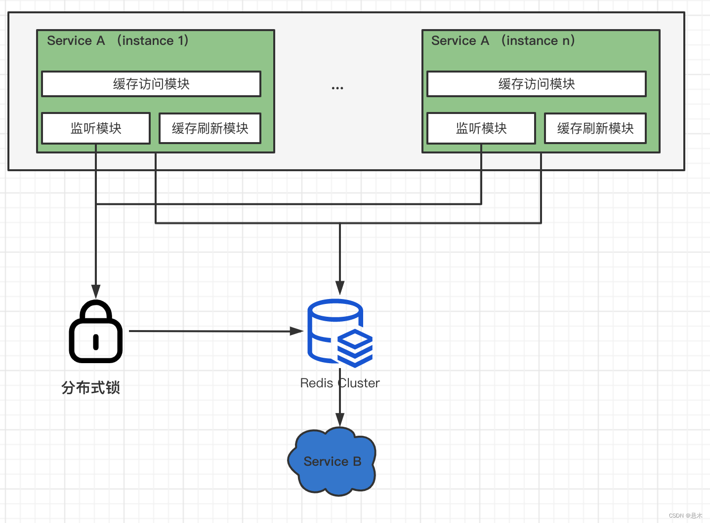

##Beehive Cache是什么?
一个依赖Redis Cluster实现的可自动刷新的缓存

##Beehive Cache有哪些功能？

* 可以设置在最后访问一定时间后自动失效
* 可以设置在缓存写入一定时间后自动刷新值


##Beehive的设计
Beehive设计场景为，当我们无法通过扩展或者简单的升级硬件解决提高依赖的服务性能时，这个时候我们就可以引入Beehive Cache实现将热点数据长效的缓存，并通过后台刷新保持缓存数据的实效性

###Beehive设计目的
为了设计一款能分布式使用，且具有长效存储和兼顾数据实时性的缓存，我们可以结合Guava Cache和Redis来进行设计，因此我们进行如下设计：
  * refreshAfterWrite, 在写入一定时间后，监听会主动刷新缓存
  * expireAfterAccess，距离最后的缓存访问时间间隔超过了允许的时间，数据即失效，并且不再进行监听刷新。
  * 统一的分布式存储，提供网络访问方式，统一存储。
  
###设计架构


##使用示例

```java
		List<String> nodeList = new ArrayList<>();
		nodeList.add("redis://*.*.*.*:*");
		RedisConfig redisConfig = new RedisConfig(nodeList, "TestRedis", 10, 5000, "****");
				
		CacheConfig cacheConfig = new CacheConfig("TestBusiness",redisConfig);
		cache = new BeehiveCache<>(cacheConfig, new CacheLoader<String, String>() {

			@Override
			public String load(String key) throws Exception {
				BufferedReader in = null;
				try {
		            URL url = new URL(key);
		            URLConnection urlConnection = url.openConnection();
		            HttpURLConnection connection = null;
		            if (urlConnection instanceof HttpURLConnection) {
		                connection = (HttpURLConnection) urlConnection;
		            } else {
		                throw new RuntimeException("load error!" + key);
		            }

		            in = new BufferedReader(new InputStreamReader(connection.getInputStream()));
		            StringBuilder content = new StringBuilder();
		            String current;

		            while ((current = in.readLine()) != null) {
		            	content.append(current);
		            }
		            return content.toString();
		        } catch (IOException e) {
		        	throw new RuntimeException("load error!" + key);
		        }finally {
					if (in != null) {
						in.close();
					}
				}
			}

			@Override
			public Map<String, String> loadAll(Iterable<? extends String> keys) {
				throw new RuntimeException("LoadAll is not supported!");
			}
		});
		
		//获取缓存值
		cache.get(new BeehiveCacheKey<String>("https://www.baidu.com/"));
```